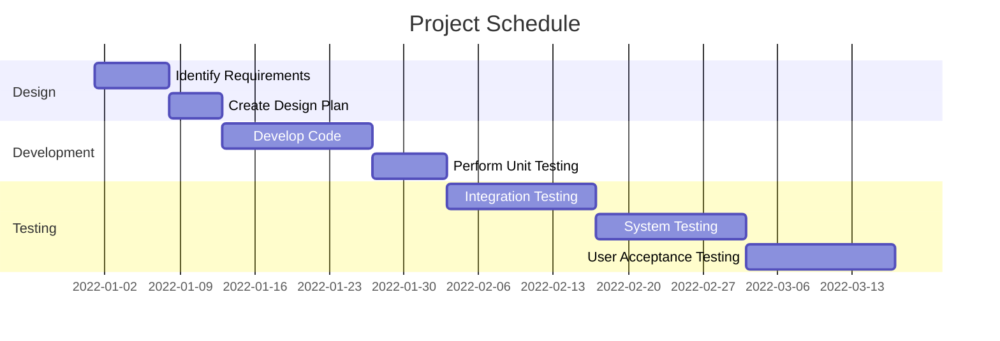

<h3 align="center">Wrap Notes Automation | Status: Active</h3>

<!-- TABLE OF CONTENTS -->

  
Table of Contents

  <ol>
    <li>
      <a href="#project-overview">Project Overview</a>
    </li>
    <li>
      <a href="#initial-mvp-breakdown">Initial MVP Breakdown</a>
    </li>
    <li>
      <a href="#business-metric/s-targetted">Business metric/s targeted</a>
    </li>
    <li>
      <a href="#stakeholders-&-ceremonies">Stakeholders & Ceremonies</a>
    </li>
    <li>
      <a href="#additional-items-for-definition-of-ready">Additional Items for Definition of Ready</a>
    </li>
    <li>
      <a href="#high-level-process-documentation">High level process documentation</a>
    </li>
    <li>
      <a href="#Project Results">Project Results</a>
    </li>
    <li>
      <a href="#Project-Schedule">Project-Schedule</a>
    </li>
  </ol>

## TL;DR:

Automation of Wrap Notes through text summarisation of webchat transcripts for Centrica's Net Zero business (particular focus on HIVE). Resulting in £200k savings, driving efficiencies and cost savings.

## Project Overview:
| Work Stream | Project Title | High Level Description | Type | Indicative business value | Initial timescale | Long Term Goal | Date Raised |
| -----------: | :-----------: | :-----------: | :-----------: | :-----------: | :-----------: | :-----------: | :-----------: |
| Net Zero | HIVE Wrap Automation (Net Zero Strategy) | Automation  | Production | £200k per annum | 5 months | Automated webchat wrap notes, significantly reducing call times | '22 |

## Initial MVP Breakdown:
- MVP 1: Produce insights regarding Wrap notes and size the project and value
- MVP 2: POC demonstrating the ability to summarise webchat transcripts to produce wrap notes of sufficient quality
- MVP 3: Improved (gold standard) model intergated into the Salesforce system and AWS Redshift  

## Business metric/s targetted:
|  | 🤬 Complaints | ☎️ Contact | 🚦 NPS | 📆 Reschedules | 📊 Solver/RFT/FTF | ⏳ Efficiency/FTE | 💻 OAM |
| -----------: | :-----------: | :-----------: | :-----------: | :-----------: | :-----------: | :-----------: | :-----------: |
| Increase 🔼 / 🔽 Reduction |  | ✔️ |  |  |  | ✔️ |  |

_________________________

## Stakeholders & Ceremonies

*✔️: Required, 💬: Optional Invite, ❌: Not required*

| Event | 👨‍👩‍👦 Project Team | 👨‍🏫 Project Lead | 🗝️ Product Owner | 👨‍💻 Manager | 👩‍💼 Senior Manager | 🕵️‍♀️ Subject Matter Expert (SME)|
| -----------: | :-----------: | :-----------: | :-----------: | :-----------: | :-----------: | :-----------: |
|  |  |
| **Backlog Planning & Refinement** | 💬 | ✔️ | ✔️ | 💬 | 💬 | ❌ |
| **Action (Task) Planning** | 💬 | ✔️ | ❌ | 💬 | ❌ | ❌ |
| **Stand-up** | ✔️ | ✔️ | ❌ | ✔️ | ❌ | ❌ |
| **Sprint Review** | ✔️ | ✔️ | ✔️ | ✔️ | ✔️ | ❌ |
| **Retrospective** | ✔️ | ✔️ | ❌ | 💬 | ❌ | ❌ |
| **Team Meeting** | ✔️ | ✔️ | ❌ | ✔️ | 💬 | ❌ |
| **DS Workshop** | ✔️ | ✔️ | ❌ | ✔️ | ❌ | ❌ |

_________________________

## Additional Items for Definition of Ready:
| Item | Details | Notes / Mitigation (Optional) |
| -----------: | :-----------: | :-----------: | 
| Data location/s identified | ✔️ | [comment] |
| Data location/s accessible | ✔️ | Accessible through AWS Redshift |
| Labour resource needed (eg # Data Scientists) | 1 x Lead, 1 x Data Scientist |  [-] |
| Technical Resource needed () | Databricks, Azure ML | [-] |
| Technical Skillset required | Transformers/Hugging Face  | [-] |
| Personal/Sensitive Data Used | ✔️ | Data obviscated and stored in locked down container  |
| Privacy Impact Assessment Required | ✔️ | PIA Ref: ****|
| Tangible output | Hand-off of trial and tested POC model to Salesforce solution architects for integration into AWS Connect | £200k savings per annum |

_________________________

## High level process documentation:
**Project Intent : -**  
****

- This project was born from the understanding that HIVE and Net Zero would need a strategy to deal with increased demand from heat pumps and Net Zero drive
- Contact costs for HIVE were increasing year on year despite a decline in sales and product purchases
- Only 30% of customers are repeat contact customers , this gives scope to automate wrap notes and in some case remove them all together
- Summarise webchat transcripts & use summary as a replacement for webchat wrap notes.

**Business value: -**  
****

- Call centres agents no longer need to spond time writing up notes after a webchat conversation
- Time saved eliminating webchat wrap notes is £200k per annum

****

## Project Results:

- Removal of webchat wrap notes
- £200k savings per annum
- Presented to Director of Hive and senior leadership

****

## Project Schedule:

The following is a Gantt chart outlining the schedule for the project:

